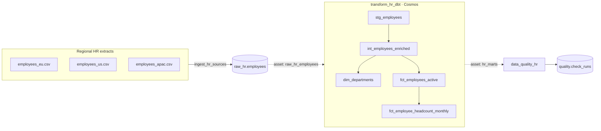

# airflow-bigquery — Modern Data Stack Orchestration

A **production-style Apache Airflow 3 project** that orchestrates a complete HR
analytics pipeline: ingest regional source extracts, transform them with **dbt**,
and enforce **data quality** — the modern data stack, end to end.

> Demonstration project. Built to show how I design and operate an
> orchestration layer on a real data platform: Airflow 3, dbt, asset-driven
> scheduling, a tested Python codebase, CI, and documentation a team can
> actually onboard from.


---

## Why this project exists

Most Airflow tutorials stop at "here is a DAG with two `BashOperator`s". A real
platform needs more: a clean separation between orchestration and business
logic, data-aware scheduling, an integrated transformation tool, an independent
quality gate, tests, CI, and a runtime that a teammate — or a recruiter — can
start with **one command and no cloud account**.

This repository is that project. It runs **100 % locally on DuckDB** out of the
box, and the *same code* targets **Google BigQuery** in production by changing
one environment variable.

It is the companion of a sibling repository, [`dbt-bigquery`](../dbt-bigquery),
which goes deeper on the dbt/BigQuery side. Together they tell one story: the
**modern data stack**, orchestrated.

---

## What this project demonstrates

**Airflow 3 — current features, not legacy patterns**

- **Asset-driven scheduling** — DAGs are triggered by *data*, not a clock: when
  ingestion publishes an asset, the dbt DAG runs; when dbt publishes the marts,
  the quality DAG runs. No sensors, no fixed offsets.
- **TaskFlow API & the Task SDK** (`airflow.sdk`) — clean, Pythonic DAGs.
- **Dynamic task mapping** — one parallel extract task per discovered source
  file, decided at run time.
- **A custom operator** — `DataQualityCheckOperator`, packaged properly.
- **Cluster policies** — org-wide guardrails enforced at parse time.
- **Pools** — modelling DuckDB's single-writer constraint explicitly.
- **CeleryExecutor** on the official Airflow 3 multi-service topology
  (api-server, scheduler, dag-processor, worker, triggerer).

**Engineering practices a senior is expected to bring**

- Orchestration logic kept **out of the DAGs** — in an installable, typed,
  unit-tested Python package (`hr_pipeline`).
- **dbt integrated through Cosmos** — every model, seed, snapshot and test is a
  first-class Airflow task with its own logs, retries and lineage.
- **Environment-driven configuration** — local DuckDB ↔ production BigQuery with
  no code change.
- **Four-job CI** — lint, unit tests, a real `dbt build`, and DAG-bag validation.
- **Architecture Decision Records** — the *why* behind every key choice.

---

## Architecture



Three data DAGs form a chain held together by **assets**, not by a schedule.
A fourth, time-scheduled DAG (`platform_maintenance`) handles housekeeping.
Full detail in [docs/architecture.md](docs/architecture.md).

---

## The pipelines

| DAG | Trigger | Role |
|-----|---------|------|
| `ingest_hr_sources` | daily | Extract & validate regional CSVs (parallel, dynamic mapping), consolidate into `raw_hr.employees`. |
| `transform_hr_dbt` | asset `raw_hr_employees` | Run the embedded dbt project via Cosmos: staging → marts, seeds, SCD2 snapshot, tests. |
| `data_quality_hr` | asset `hr_marts` | Independent post-build quality gate; one task per check; persists an audit trail. |
| `platform_maintenance` | weekly | Connectivity probe, warehouse inventory, scratch-file cleanup. |

A walkthrough of each DAG: [docs/dags.md](docs/dags.md).

---

## Repository structure

```
airflow-bigquery/
├── dags/                       Airflow DAGs (orchestration only)
│   ├── common.py               shared defaults + failure callback
│   ├── ingest_hr_sources.py    DAG 1 — ingestion
│   ├── transform_hr_dbt.py     DAG 2 — dbt via Cosmos
│   ├── data_quality_hr.py      DAG 3 — data quality gate
│   └── platform_maintenance.py DAG 4 — housekeeping
├── src/hr_pipeline/            installable Python package (the real logic)
│   ├── config.py               environment-driven Settings
│   ├── warehouse.py            DuckDB / BigQuery abstraction
│   ├── ingestion.py            extract → land → load
│   ├── assets.py               Airflow Asset definitions
│   ├── quality/                data quality engine + HR suite
│   └── operators/              custom operators
├── include/
│   ├── dbt/                    embedded, portable dbt project
│   └── data/raw/               sample regional HR extracts
├── config/
│   └── airflow_local_settings.py   cluster policies
├── tests/                      unit tests + DAG-integrity tests
├── scripts/seed_local_warehouse.py local seeding helper (no Airflow)
├── docs/                       architecture, guides, ADRs
├── .github/workflows/ci.yml    4-job CI pipeline
├── docker-compose.yaml         Airflow 3 cluster (CeleryExecutor)
├── Dockerfile                  custom image (Airflow + dbt + Cosmos + package)
├── requirements.txt / pyproject.toml
└── Makefile
```

---

## Tech stack

`Apache Airflow 3.1` · `astronomer-cosmos` · `dbt-core 1.9+` · `DuckDB` (local) ·
`Google BigQuery` (production) · `Python 3.12` · `Docker Compose` ·
`pytest` · `ruff` · `GitHub Actions`

---

## Quickstart

**Prerequisites:** Docker Desktop (or Docker Engine) with **~6 GB** of memory
available to it, and Docker Compose v2.

```bash
# 1. Configuration
cp .env.example .env            # PowerShell: Copy-Item .env.example .env

# 2. Build the custom image
docker compose build

# 3. One-shot bootstrap (DB migration, admin user, the `dbt` pool)
docker compose up airflow-init

# 4. Start the cluster
docker compose up -d

# 5. Open the UI — login airflow / airflow
#    http://localhost:8080
```

Then, in the Airflow UI, unpause and trigger **`ingest_hr_sources`**. Asset
scheduling takes over: `transform_hr_dbt` runs when ingestion finishes, and
`data_quality_hr` runs when dbt finishes — the whole chain, hands-free.

With `make` available, the same flow is `make build && make init && make up`.
Stop everything with `docker compose down` (add `--volumes` for a clean slate).

Detailed walkthrough & troubleshooting: [docs/local-development.md](docs/local-development.md).

---

## Local vs. production — one codebase

| | Local (default) | Production |
|--|------------------|------------|
| `HR_ENV` | `local` | `production` |
| Warehouse | DuckDB file | Google BigQuery |
| Credentials | none | GCP service account |
| dbt target | `dev` | `prod` |

The pipeline reads its warehouse from `hr_pipeline.config.Settings`, resolved
from environment variables. No DAG, no model and no SQL changes between the two.
The production path is documented in [docs/production-gcp.md](docs/production-gcp.md).

---

## Quality & testing

- **dbt tests** run inside `transform_hr_dbt` — generic, custom and singular.
- **An independent quality suite** (`data_quality_hr`) re-verifies the published
  marts and records every run — see [docs/data-quality.md](docs/data-quality.md).
- **`pytest`** covers the `hr_pipeline` package and validates the DAG bag.
- **CI** (`.github/workflows/ci.yml`) runs lint, unit tests, a full `dbt build`
  on DuckDB, and DAG-bag validation on every push and pull request.

```bash
pytest -m "not dags"   # fast unit tests (no Airflow needed)
pytest -m dags         # DAG-integrity tests (needs Airflow + Cosmos)
```

---

## Documentation

| Document | Content |
|----------|---------|
| [docs/architecture.md](docs/architecture.md) | Components, data flow, scheduling model |
| [docs/dags.md](docs/dags.md) | Per-DAG walkthrough |
| [docs/local-development.md](docs/local-development.md) | Running, debugging, troubleshooting |
| [docs/production-gcp.md](docs/production-gcp.md) | Deploying against BigQuery |
| [docs/data-quality.md](docs/data-quality.md) | The quality strategy |
| [LEARNING_GUIDE.md](LEARNING_GUIDE.md) | Guided tour of every concept, hands-on |
| [docs/adr/](docs/adr/) | Architecture Decision Records — the *why* |

---

*Built by **Yann Levavasseur** — Senior Data Engineer (Databricks & Azure · Cloud / DevOps).
Companion to the [`dbt-bigquery`](../dbt-bigquery) analytics-engineering repository.*
