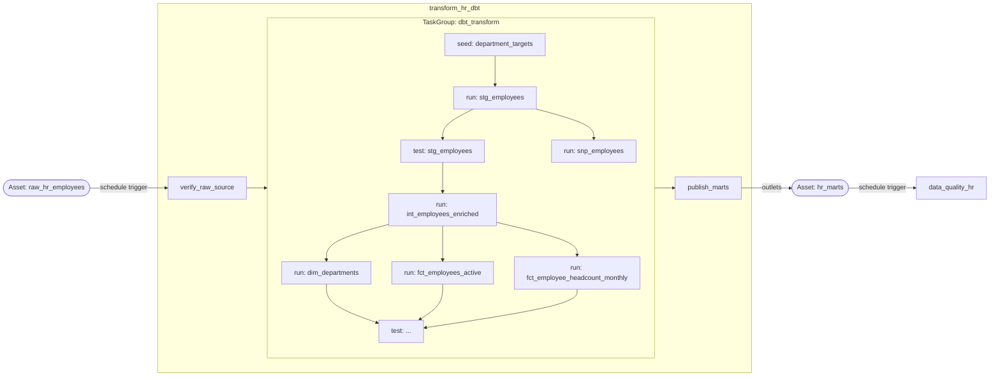
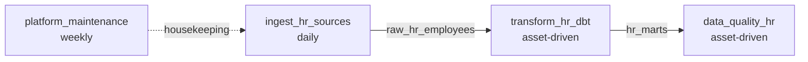

# Deep Dive — `dags/transform_hr_dbt.py`

> Annotation complète du DAG de transformation. Chaque décision est justifiée — de
> l'exception parse-time à la sérialisation DuckDB en passant par ce que Cosmos fait
> réellement sous le capot.

---

## Pourquoi ce fichier existe

Le pipeline HR a besoin d'une étape de transformation : prendre les données brutes
landées par `ingest_hr_sources` et les convertir en marts analytiques propres
(`dim_departments`, `fct_employees_active`, `fct_employee_headcount_monthly`).

L'option naïve serait un `BashOperator` unique qui lance `dbt build`. Elle fonctionnerait.
Mais elle produirait **une tâche opaque** dans l'UI Airflow : un seul bloc vert ou rouge,
sans distinguer quel modèle a échoué, sans logs par modèle, sans retry ciblé, sans lineage.

La décision architecturale documentée dans
[ADR-0003](../adr/0003-cosmos-for-dbt-orchestration.md) tranche autrement :
orchestrer dbt via **astronomer-cosmos**, qui parse le projet dbt et rend **chaque
modèle, seed, snapshot et test comme une tâche Airflow native**. L'intégration dbt ×
Airflow devient totale : l'UI Airflow montre exactement où la transformation a cassé,
avec le log dbt du modèle concerné, et peut rejouer ce seul modèle.

`transform_hr_dbt.py` est le pivot central du pipeline : il consomme le résultat de
l'ingestion (via Asset) et produit les marts que la qualité va vérifier (via Asset).

!!! note "ADR de référence"
    - [ADR-0002](../adr/0002-airflow-3-and-asset-driven-scheduling.md) — asset-driven scheduling
    - [ADR-0003](../adr/0003-cosmos-for-dbt-orchestration.md) — Cosmos pour dbt
    - [ADR-0007](../adr/0007-dag-parse-time-vs-run-time-configuration.md) — parse-time vs run-time

---

## Vue d'ensemble

`transform_hr_dbt` tourne le projet dbt embarqué dans `include/dbt/` via Cosmos. Il
produit l'intégralité de la couche marts — staging, intermediate, marts, seeds, snapshot
SCD2 et tests dbt — chacun comme une tâche Airflow.

**Shape du DAG :**



**Résumé :**

| Propriété | Valeur |
|---|---|
| Schedule | Asset-driven — `[RAW_HR_EMPLOYEES]` |
| Produit | Asset `HR_MARTS` |
| Catchup | `False` |
| Max active runs | 1 |
| Pool dbt | 1 slot (DuckDB), extensible BigQuery |
| Retry par tâche dbt | 1 (en plus des 2 DEFAULT_ARGS) |

---

## Walkthrough complet

### Imports et `from __future__ import annotations`

```python
from __future__ import annotations

from airflow.exceptions import AirflowException
from airflow.sdk import dag, task
from cosmos import DbtTaskGroup, ExecutionConfig, ProfileConfig, ProjectConfig
from cosmos.constants import ExecutionMode

from common import DEFAULT_ARGS, DEFAULT_START_DATE
from hr_pipeline.assets import HR_MARTS, RAW_HR_EMPLOYEES
from hr_pipeline.config import Settings
from hr_pipeline.ingestion import RAW_EMPLOYEES_TABLE
from hr_pipeline.warehouse import get_warehouse
```

`from airflow.sdk import dag, task` — c'est l'API Airflow 3 (Task SDK). Sur Airflow 2,
les mêmes noms vivaient dans `airflow.decorators`. Le Task SDK est l'API actuelle et
recommandée.

`from cosmos import ...` — les quatre objets Cosmos que ce DAG utilise :
`DbtTaskGroup` pour encapsuler le projet dbt comme un groupe de tâches, et les trois
configs (`ProjectConfig`, `ProfileConfig`, `ExecutionConfig`) qui décrivent respectivement
où est le projet dbt, quel profil utiliser, et comment exécuter dbt.

`from common import DEFAULT_ARGS, DEFAULT_START_DATE` — centralisation des defaults.
Jamais redéfinis localement. Voir `dags/common.py` pour le détail du retry policy et du
`on_failure_callback`.

---

### L'exception parse-time — `_settings = Settings.from_env()`

```python
# Resolved once at parse time — the DAG processor has the full environment.
_settings = Settings.from_env()
```

!!! warning "La seule exception documentée à la règle parse-time"
    La règle générale du projet (ADR-0007) interdit `Settings.from_env()` au niveau
    module d'un DAG. Ce fichier est **l'unique exception explicitement documentée**.

Voici pourquoi cette exception est inévitable.

Cosmos doit construire le `DbtTaskGroup` au moment où Python importe le module — c'est-à-dire
au **parse time**, quand le DAG processor d'Airflow scanne les fichiers. Pour construire
ce groupe, Cosmos a besoin de :

- `dbt_project_dir` — pour trouver `dbt_project.yml`, parcourir les modèles, et construire
  le graphe de dépendances dbt qui deviendra le graphe de tâches Airflow.
- `profiles_yml_filepath` — pour valider la configuration de connexion.
- `dbt_target` — pour choisir entre le target `dev` (DuckDB) et `prod` (BigQuery).

Ces trois valeurs viennent de `Settings`. Il n'y a pas d'alternative : si on déplace
`Settings.from_env()` à l'intérieur d'une `@task`, le `DbtTaskGroup` n'est plus
construit — on obtient un DAG vide.

**Ce que cette exception ne cause pas :** un `Settings.from_env()` en production
(`HR_ENV=production`) au parse-time appellera `validate()`, qui exige `GCP_PROJECT`.
Si `GCP_PROJECT` n'est pas défini, on obtient un import error DAG — une alerte rouge
dans l'UI. C'est le comportement attendu : un cluster mal configuré doit le signaler.

!!! tip "Différence avec `data_quality_hr`"
    `data_quality_hr.py` a aussi du code au niveau module (`_QUALITY_SUITE`), mais
    utilise `os.getenv()` directement — pas `Settings.from_env()`. C'est parce qu'il
    n'a besoin que d'un seul champ (`marts_schema`) et `os.getenv()` ne lève jamais
    d'exception. La règle : quand Cosmos vous y force, utilisez `Settings.from_env()`.
    Sinon, préférez `os.getenv()` au parse-time.

---

### Configuration Cosmos

```python
_profile_config = ProfileConfig(
    profile_name="hr_analytics",
    target_name=_settings.dbt_target,
    profiles_yml_filepath=str(_settings.dbt_project_dir / "profiles.yml"),
)
_project_config = ProjectConfig(dbt_project_path=str(_settings.dbt_project_dir))
_execution_config = ExecutionConfig(execution_mode=ExecutionMode.LOCAL)
```

Trois objets de configuration, trois rôles distincts :

**`ProfileConfig`** — dit à Cosmos *comment se connecter* au warehouse. `profile_name`
correspond au bloc de premier niveau dans `profiles.yml` (`hr_analytics:`). `target_name`
vaut `"dev"` en local (DuckDB) ou `"prod"` en production (BigQuery) — c'est `Settings.dbt_target`
qui fait cette translation. En changeant uniquement `HR_ENV`, le même DAG bascule de
DuckDB vers BigQuery sans modifier une ligne de code.

**`ProjectConfig`** — dit à Cosmos *où trouver le projet dbt*. Cosmos va lire
`dbt_project.yml`, parcourir `models/`, `snapshots/`, `seeds/`, `tests/` pour construire
le graphe de dépendances qu'il transformera en tâches Airflow.

**`ExecutionConfig(execution_mode=ExecutionMode.LOCAL)`** — dit à Cosmos *comment
exécuter dbt*. `LOCAL` signifie que Cosmos appelle directement le binaire dbt installé
dans l'image Docker du worker Airflow. C'est le mode le plus simple.

Les alternatives sont résumées dans la section [Cosmos deep-dive](#cosmos-deep-dive) plus bas.

---

### Le décorateur `@dag`

```python
@dag(
    dag_id="transform_hr_dbt",
    description="Transform raw HR data into curated marts with dbt (via Cosmos).",
    schedule=[RAW_HR_EMPLOYEES],
    start_date=DEFAULT_START_DATE,
    catchup=False,
    max_active_runs=1,
    default_args=DEFAULT_ARGS,
    tags=["hr", "transformation", "dbt", "layer:marts"],
)
def transform_hr_dbt() -> None:
```

**`schedule=[RAW_HR_EMPLOYEES]`** — les crochets sont essentiels. En Airflow 3, une
liste d'Assets en schedule signifie "déclenche-toi dès qu'un des Assets de cette liste
est mis à jour". Sans les crochets (`schedule=RAW_HR_EMPLOYEES`), Airflow interpréterait
la valeur comme une cron expression et lèverait une erreur à l'import.

C'est le cœur de l'asset-driven scheduling : ce DAG ne connaît pas l'existence de
`ingest_hr_sources`. Il sait seulement qu'il attend `raw_hr_employees`. Si demain on
remplace `ingest_hr_sources` par un autre système qui produit le même Asset, ce DAG
se déclenche sans modification.

**`catchup=False`** — sans ceci, Airflow tenterait de rejouer toutes les runs manquées
depuis `start_date`. Pour un DAG asset-driven, cela n'a pas de sens : il n'y a pas eu
de "runs manquées", juste des moments où l'Asset n'a pas été produit.

**`max_active_runs=1`** — DuckDB ne supporte pas les écritures concurrentes. Deux runs
simultanées créeraient une deadlock sur le fichier `.duckdb`. Ce paramètre garantit
qu'une seule run tourne à la fois. Même en production BigQuery, `max_active_runs=1`
est une bonne pratique pour les transformations dbt qui reconstruisent des tables.

---

### `verify_raw_source` — le garde-fou

```python
@task
def verify_raw_source() -> dict[str, int]:
    """Fail fast if the raw table dbt depends on is missing or empty."""
    settings = Settings.from_env()
    with get_warehouse(settings, read_only=True) as warehouse:
        if not warehouse.table_exists(settings.raw_schema, RAW_EMPLOYEES_TABLE):
            raise AirflowException(
                f"{settings.raw_schema}.{RAW_EMPLOYEES_TABLE} does not exist — "
                "run the ingest_hr_sources DAG first."
            )
        rows = warehouse.row_count(settings.raw_schema, RAW_EMPLOYEES_TABLE)
    if rows == 0:
        raise AirflowException(f"{settings.raw_schema}.{RAW_EMPLOYEES_TABLE} is empty.")
    return {"raw_rows": rows}
```

Cette tâche répond à une question : pourquoi ne pas laisser dbt échouer seul si la
source est absente ?

dbt échouerait effectivement — mais avec un message d'erreur SQL cryptique enterré
dans les logs du modèle `stg_employees` (premier modèle à lire `raw_hr.employees`).
Un opérateur verrait une tâche rouge sans contexte immédiat. `verify_raw_source` échoue
**avant** que Cosmos ne démarre, avec un message actionnable : "la table n'existe pas,
lance d'abord `ingest_hr_sources`."

**`read_only=True`** — cette tâche ne fait que lire (`table_exists`, `row_count`). Elle
n'a pas besoin d'acquérir le verrou d'écriture DuckDB. Sans ce flag, elle entrerait en
concurrence avec d'autres tâches du pool `dbt` sur le verrou du fichier `.duckdb`, même
si elle ne modifie rien. Avec `read_only=True`, elle utilise une connexion DuckDB en mode
lecture seule et ne bloque pas.

!!! note "DuckDB read-only en pratique"
    DuckDB supporte plusieurs lecteurs simultanés, mais un seul écrivain à la fois.
    `read_only=True` dans `get_warehouse()` ouvre le fichier `.duckdb` en mode
    `read_only=True` de l'API DuckDB — compatible avec une connexion d'écriture
    ouverte ailleurs (par le pool dbt par exemple).

---

### `DbtTaskGroup` — le cœur du DAG

```python
dbt_transform = DbtTaskGroup(
    group_id="dbt_transform",
    project_config=_project_config,
    profile_config=_profile_config,
    execution_config=_execution_config,
    operator_args={"pool": "dbt"},
    default_args={"retries": 1},
)
```

C'est la ligne qui remplace des dizaines de `BashOperator` manuels. Cosmos parse le
projet dbt et génère dynamiquement un groupe de tâches Airflow, une par nœud du graphe dbt.

**`operator_args={"pool": "dbt"}`** — applique le pool `dbt` à **toutes** les tâches
générées par Cosmos, y compris les tests, les seeds et le snapshot. Sans ce paramètre,
les tâches Cosmos n'auraient pas de pool, et plusieurs d'entre elles pourraient s'exécuter
en parallèle — ce qui deadlockerait DuckDB.

**`default_args={"retries": 1}`** — ajoute un retry par modèle, en plus des 2 retries
de `DEFAULT_ARGS`. Pourquoi ? Un modèle dbt peut échouer sur une erreur transitoire de
connexion (BigQuery timeout, file lock DuckDB momentané). Un retry automatique évite
d'avoir à rejouer manuellement un modèle qui aurait réussi à la deuxième tentative.

**Pourquoi `DbtTaskGroup` et pas `DbtDag` ?** Cosmos propose aussi un `DbtDag` — un
DAG complet généré par Cosmos seul. `DbtTaskGroup` est plus flexible : il permet
d'entourer le bloc dbt de tâches Airflow natives (`verify_raw_source` avant,
`publish_marts` après). C'est le pattern recommandé pour les pipelines hybrides.

---

### `publish_marts` — le producteur d'Asset

```python
@task(outlets=[HR_MARTS])
def publish_marts() -> dict[str, int]:
    """Confirm the marts were built and publish the `hr_marts` asset."""
    settings = Settings.from_env()
    marts = (
        "fct_employees_active",
        "dim_departments",
        "fct_employee_headcount_monthly",
    )
    with get_warehouse(settings, read_only=True) as warehouse:
        counts = {mart: warehouse.row_count(settings.marts_schema, mart) for mart in marts}
    for mart, count in counts.items():
        if count == 0:
            raise AirflowException(f"Mart {mart} is empty after the dbt run.")
    return counts
```

**`outlets=[HR_MARTS]`** — c'est le mécanisme qui déclenche `data_quality_hr`. Quand
cette tâche se termine avec succès, Airflow marque l'Asset `hr_marts` comme mis à jour.
Tous les DAGs schedulés sur `[HR_MARTS]` (ici `data_quality_hr`) sont alors déclenchés.

**La validation avant publication est délibérée.** Si `publish_marts` se contente de
publier l'Asset sans vérifier, `data_quality_hr` se déclencherait même si dbt a produit
des tables vides (bug silencieux dans un modèle). En validant que chaque mart contient
au moins une ligne, on garantit que `data_quality_hr` ne tourne que sur des données
réelles.

**Si `publish_marts` échoue, `data_quality_hr` n'est pas déclenché** — l'Asset n'est
pas mis à jour. C'est le comportement souhaité : la qualité ne vérifie que les données
que la transformation a validées.

**`read_only=True`** — même logique que `verify_raw_source`. Cette tâche ne lit que
les comptages. Elle s'exécute après le `DbtTaskGroup`, quand dbt a libéré ses connexions
d'écriture — pas de risque de contention ici, mais le flag est maintenu par cohérence
et défense en profondeur.

---

### Dépendances et chaîne d'exécution

```python
verify_raw_source() >> dbt_transform >> publish_marts()
```

Trois étapes enchaînées avec l'opérateur `>>` (bitshift) du TaskFlow API :

1. `verify_raw_source()` — vérifie que la source existe et est non vide.
2. `dbt_transform` — groupe Cosmos, exécute tout le projet dbt.
3. `publish_marts()` — valide les marts et publie l'Asset.

Si l'une échoue, les suivantes ne s'exécutent pas. C'est le comportement par défaut
d'Airflow (`trigger_rule="all_success"`).

---

## Connexions

### Upstream — `ingest_hr_sources` via `RAW_HR_EMPLOYEES`

```
ingest_hr_sources
    └── load_raw  @task(outlets=[RAW_HR_EMPLOYEES])
            │
            │  Asset event: raw_hr_employees updated
            ▼
    transform_hr_dbt  schedule=[RAW_HR_EMPLOYEES]
```

`transform_hr_dbt` ne connaît pas `ingest_hr_sources`. Il est schedulé sur l'Asset
`RAW_HR_EMPLOYEES`. Si `ingest_hr_sources` tourne et que `load_raw` réussit, Airflow
émet un événement Asset. Airflow 3 détecte que `transform_hr_dbt` est abonné à cet
Asset et déclenche une nouvelle run.

Avantage par rapport à un `ExternalTaskSensor` : aucun slot worker consommé en attente,
aucun couplage sur la durée ou le schedule de l'upstream. `transform_hr_dbt` démarre
exactement quand les données sont prêtes — ni avant ni après.

### Downstream — `data_quality_hr` via `HR_MARTS`

```
transform_hr_dbt
    └── publish_marts  @task(outlets=[HR_MARTS])
            │
            │  Asset event: hr_marts updated
            ▼
    data_quality_hr  schedule=[HR_MARTS]
```

Symétrique. `publish_marts` porte `outlets=[HR_MARTS]`. Si la tâche réussit (marts
non vides, dbt run complet), l'Asset `hr_marts` est mis à jour et `data_quality_hr`
est déclenché.

### Vue globale de la chaîne



---

## Cosmos deep-dive

### Ce que Cosmos fait sous le capot

Quand Python importe `transform_hr_dbt.py`, Cosmos exécute les étapes suivantes lors
de la construction du `DbtTaskGroup` :

1. **Parsing du projet dbt** — Cosmos lit `dbt_project.yml` et parcourt récursivement
   les dossiers `models/`, `snapshots/`, `seeds/`, `tests/`. Il construit un graphe de
   nœuds dbt.

2. **Résolution du graphe de dépendances** — chaque modèle dbt référençant `ref()` ou
   `source()` crée une arête dans le graphe. Cosmos résout ces références pour construire
   l'ordre topologique.

3. **Génération de tâches Airflow** — chaque nœud dbt devient une ou deux tâches Airflow :
   - Un nœud modèle génère une tâche `DbtRunOperator` (qui lance `dbt run --select <model>`)
     suivie d'une tâche `DbtTestOperator` (qui lance `dbt test --select <model>`).
   - Un nœud seed génère une tâche `DbtSeedOperator`.
   - Un nœud snapshot génère une tâche `DbtSnapshotOperator`.
   - Les tests singuliers (`tests/`) deviennent des `DbtTestOperator` standalone.

4. **Conversion des arêtes dbt en dépendances Airflow** — si le modèle B dépend du
   modèle A dans dbt, la tâche `A.run` précède `B.run` dans le graphe Airflow.

Pour le projet `include/dbt/`, Cosmos génère approximativement les tâches suivantes
dans le groupe `dbt_transform` :

| Tâche Cosmos | Type | Correspond à |
|---|---|---|
| `department_targets.seed` | `DbtSeedOperator` | `seeds/department_targets.csv` |
| `stg_employees.run` | `DbtRunOperator` | `models/staging/stg_employees.sql` |
| `stg_employees.test` | `DbtTestOperator` | Tests génériques sur `stg_employees` |
| `int_employees_enriched.run` | `DbtRunOperator` | `models/intermediate/int_employees_enriched.sql` |
| `snp_employees.snapshot` | `DbtSnapshotOperator` | `snapshots/snp_employees.sql` |
| `dim_departments.run` | `DbtRunOperator` | `models/marts/dim_departments.sql` |
| `fct_employees_active.run` | `DbtRunOperator` | `models/marts/fct_employees_active.sql` |
| `fct_employee_headcount_monthly.run` | `DbtRunOperator` | `models/marts/fct_employee_headcount_monthly.sql` |
| `*.test` | `DbtTestOperator` | Tests génériques + singuliers (assert_no_future_hires) |

### Ce que Cosmos n'est pas

Cosmos n'est **pas** un wrapper autour de `dbt build`. Il ne lance pas un processus dbt
global. Chaque tâche Cosmos lance une commande dbt ciblée (`dbt run --select stg_employees`,
`dbt test --select stg_employees`, etc.). dbt démarre et s'arrête pour chaque modèle.

Implication : le temps total d'une run Cosmos est plus long qu'un `dbt build` unique
à cause de l'overhead de démarrage dbt par tâche. C'est le compromis accepté (ADR-0003)
pour obtenir la granularité d'observabilité.

### Les modes d'exécution Cosmos

| Mode | Comment | Avantages | Inconvénients |
|---|---|---|---|
| `LOCAL` | dbt appelé directement dans le worker | Simple, rapide, pas d'overhead | dbt partage l'env Python Airflow |
| `VIRTUALENV` | Cosmos crée un virtualenv par tâche | Isolation totale des dépendances | Plus lent (création virtualenv), plus de disque |
| `KUBERNETES` | Chaque tâche dans un pod K8s | Scale infini, isolation parfaite | Infrastructure K8s requise, latence pod startup |

Ce projet utilise `LOCAL`. L'image Docker inclut `astronomer-cosmos[dbt-duckdb]` qui
installe dbt-core et dbt-duckdb dans le même environnement qu'Airflow. Si un conflit
de dépendance apparaît, passer en `VIRTUALENV` est l'upgrade path naturel (ADR-0003).

---

## Le pool `dbt`

### Pourquoi un pool dédié

DuckDB est une base embarquée qui stocke tout dans un fichier unique. Sa contrainte
fondamentale : **un seul processus écrivain à la fois**. Plusieurs processus peuvent lire
simultanément, mais dès qu'un processus ouvre le fichier en écriture, tous les autres
processus tentant d'écrire obtiennent une erreur de verrouillage.

Sans pool, Cosmos pourrait lancer plusieurs tâches `DbtRunOperator` en parallèle
(selon le nombre de slots Airflow disponibles et les dépendances dbt). Chaque tâche
ouvrirait le fichier DuckDB en écriture. La deuxième tâche à arriver obtiendrait :

```
dbt.exceptions.DbtDatabaseError: Database Error
  IO Error: Could not set lock on file "warehouse.duckdb":
  Resource temporarily unavailable
```

Le pool `dbt` avec `slots=1` sérialise toutes les tâches du groupe Cosmos : une seule
s'exécute à la fois, les autres attendent dans la queue du pool. Le graphe de dépendances
dbt reste visible dans l'UI, mais l'exécution est séquentielle.

### Configuration du pool

Le pool est créé par `docker compose up airflow-init` (via la procédure d'initialisation
qui appelle `airflow pools set dbt 1 "dbt serialization pool"`). Il est appliqué à
toutes les tâches Cosmos via `operator_args={"pool": "dbt"}`.

```python
# Dans DbtTaskGroup — appliqué à chaque tâche générée par Cosmos
operator_args={"pool": "dbt"},
```

!!! warning "Sans ce paramètre"
    Si `operator_args={"pool": "dbt"}` est absent, les tâches Cosmos n'ont pas de
    pool. En local DuckDB, les premières tâches parallèles deadlockeront. L'erreur
    est claire dans les logs dbt, mais difficile à diagnostiquer si on ne connaît pas
    la contrainte DuckDB.

### Migration vers BigQuery

Le pool `dbt` est la **seule** chose qui change entre DuckDB et BigQuery pour la
parallélisation. BigQuery supporte les writes concurrentes sur des tables différentes.
Pour exploiter le parallélisme du graphe dbt :

```sql
-- Via l'UI Airflow (Admin > Pools) ou via CLI
airflow pools set dbt 8 "dbt pool — BigQuery production"
```

```bash
# Via Docker Compose exec
docker compose exec airflow-webserver airflow pools set dbt 8 "dbt pool — BigQuery"
```

Aucun changement de code. Le `operator_args={"pool": "dbt"}` reste, mais avec 8 slots,
jusqu'à 8 tâches Cosmos peuvent s'exécuter simultanément — dans la limite du graphe de
dépendances dbt.

| Environnement | Pool `dbt` slots | Comportement |
|---|---|---|
| Local (DuckDB) | 1 | Séquentiel — obligatoire |
| Staging (BigQuery) | 4 | Parallélisme modéré |
| Production (BigQuery) | 8–16 | Parallélisme maximal |

---

## Pièges & gotchas

| Piège | Symptôme | Solution |
|---|---|---|
| Oublier `operator_args={"pool": "dbt"}` | Deadlock DuckDB sur les premières tâches parallèles | Toujours passer `operator_args` à `DbtTaskGroup` |
| `schedule=RAW_HR_EMPLOYEES` sans crochets | Import error : Airflow attend une cron string | Toujours `schedule=[RAW_HR_EMPLOYEES]` (liste) |
| `max_active_runs` absent ou > 1 | Deux runs simultanées → deadlock DuckDB ou données incohérentes en BigQuery | `max_active_runs=1` obligatoire en DuckDB |
| `_settings` capturant un env de CI sans dbt installé | `DbtTaskGroup` lève à la construction | S'assurer que `DBT_PROJECT_DIR` existe dans l'env CI |
| Mart vide après dbt run (bug silencieux) | `data_quality_hr` tourne sur des tables vides | `publish_marts` vérifie les comptages avant de publier l'Asset |
| `profiles.yml` avec mauvais target | dbt échoue sur chaque tâche avec `profile not found` | `_settings.dbt_target` doit correspondre à un bloc dans `profiles.yml` |
| Ajouter un nouveau mart sans mettre à jour `publish_marts` | Nouveau mart non vérifié, Asset publié quand même | Mettre à jour le tuple `marts` dans `publish_marts` |
| Tests dbt dans un pool différent | Tests et runs en parallèle sur DuckDB | `operator_args` s'applique à tout — seeds, runs et tests |

!!! tip "Déboguer un modèle Cosmos qui échoue"
    Dans l'UI Airflow, naviguer dans le groupe `dbt_transform`, cliquer sur la tâche
    rouge (ex: `fct_employees_active.run`), puis **Logs**. Les logs contiennent la
    sortie complète de `dbt run --select fct_employees_active` — exactement ce qu'on
    verrait en lançant dbt manuellement. Pour rejouer ce seul modèle, utiliser
    **Clear** sur la tâche concernée (pas sur tout le groupe).

!!! warning "Ajouter un modèle dbt : aucun changement Python nécessaire"
    Cosmos découvre automatiquement les nouveaux fichiers SQL au prochain parse du DAG.
    Ajouter `models/marts/new_mart.sql` au projet dbt suffit — Cosmos créera la tâche
    correspondante. En revanche, si ce mart doit être vérifié par `publish_marts`,
    il faut manuellement l'ajouter au tuple `marts` dans cette tâche.

!!! note "Le pool ne limite pas le parallélisme du graphe dbt visible dans l'UI"
    Même avec `slots=1`, l'UI Airflow affiche le graphe complet avec toutes les
    dépendances. La sérialisation est une contrainte d'exécution, pas une contrainte
    de représentation. On voit le graphe complet — on attend que le slot se libère
    pour exécuter.
