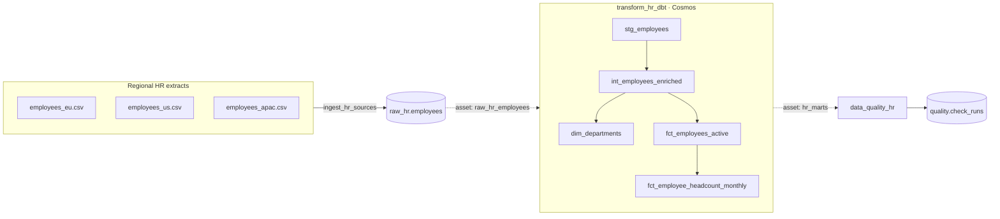

# airflow-bigquery

**A production-style Apache Airflow 3 pipeline** that orchestrates a complete
HR analytics workflow — ingest regional source extracts, transform with **dbt**,
and enforce **data quality** — running on a laptop or Google BigQuery with no
code changes.

---

## The pipeline at a glance



Three data DAGs form a chain held together by **Airflow Assets** — not a clock,
not a sensor. A fourth time-driven DAG handles platform housekeeping.

---

## The four DAGs

| DAG | Trigger | Role |
|-----|---------|------|
| `ingest_hr_sources` | daily | Extract & validate regional CSVs in parallel, consolidate into `raw_hr.employees` |
| `transform_hr_dbt` | asset `raw_hr_employees` | Run the embedded dbt project via Cosmos: staging → marts, seeds, SCD2 snapshot, tests |
| `data_quality_hr` | asset `hr_marts` | Independent post-build quality gate; one task per check; persists an audit trail |
| `platform_maintenance` | weekly | Connectivity probe, warehouse inventory, scratch-file cleanup |

---

## What this project demonstrates

<div class="grid cards" markdown>

-   :material-clock-fast: **Airflow 3 — current features**

    Asset-driven scheduling, TaskFlow API, dynamic task mapping, custom
    operator, cluster policies, pools — all in production-shaped code.

-   :material-code-braces: **Engineering practices**

    Orchestration logic kept out of the DAGs. An installable, typed,
    unit-tested `hr_pipeline` package. Four-job CI pipeline.

-   :material-database: **dbt via Cosmos**

    Every model, seed, snapshot and test is a native Airflow task with
    per-model retries, logs and lineage.

-   :material-swap-horizontal: **Local ↔ Production**

    DuckDB locally (zero credentials), Google BigQuery in production.
    One environment variable switches the entire stack.

</div>

---

## Quick start

**Requires:** Docker Desktop with ~6 GB of memory available.

```bash
# 1. Copy the environment template
cp .env.example .env          # PowerShell: Copy-Item .env.example .env

# 2. Build the custom image
docker compose build

# 3. Bootstrap (DB migration, admin user, pools)
docker compose up airflow-init

# 4. Start the cluster
docker compose up -d

# 5. Open the UI — login: airflow / airflow
#    http://localhost:8080
```

Then unpause and trigger **`ingest_hr_sources`**. Asset scheduling takes over —
the full chain runs hands-free.

Full walkthrough in [Local Development](local-development.md).

---

## Tech stack

`Apache Airflow 3.1` · `astronomer-cosmos` · `dbt-core 1.9+` · `DuckDB`
(local) · `Google BigQuery` (production) · `Python 3.12` · `Docker Compose` ·
`pytest` · `ruff` · `GitHub Actions`
